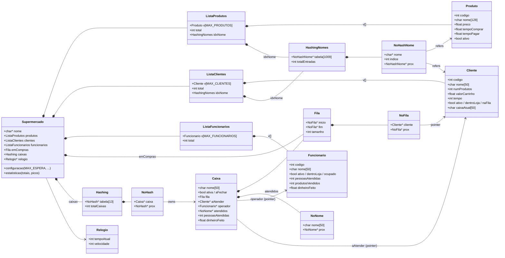
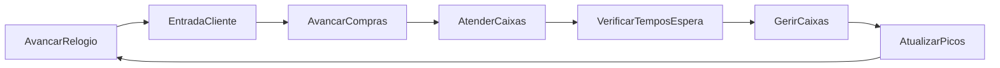
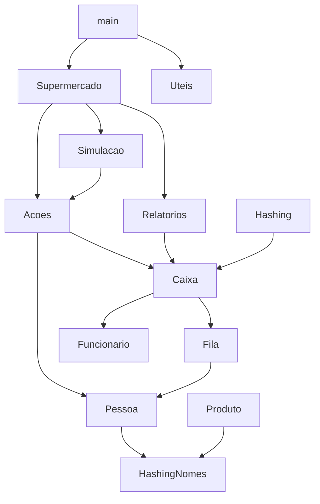

# Estruturas de dados e dependências

Este documento corresponde ao requisito do enunciado:
*"A ilustração das dependências entre as várias entidades (estruturas) criadas"*.

## Visão geral

## Notação

- `*--`: **composição** (a estrutura pai contém / é dona da memória da filha).
- `-->`: **referência** (ponteiro/índice; o pai não liberta a filha).

Pelas regras de Doxygen, esta convenção corresponde a *"strong containment"*
para os arrays-mestre e listas ligadas; e a *"weak association"* para os
ponteiros que apenas referenciam objectos que vivem noutro array.

## Quem aloca/liberta o quê

| Estrutura | Onde está alocada | Quem liberta |
|-----------|-------------------|--------------|
| `Supermercado` | `malloc` em `CriarSupermercado` | `DestruirSupermercado` |
| Arrays-mestre `v[]` (produtos, clientes, funcionarios) | dentro do `Supermercado` (stack-like) | libertados com o `Supermercado` |
| `Caixa` (cada uma) | `malloc` em `CriarCaixa` | `DestruirCaixa` (via `DestruirHashing`) |
| Nós da `Fila` (`NoFila`) | `malloc` em `EnfileirarCliente` | `DesenfileirarCliente`/`DestruirFila` |
| Nós dos atendidos (`NoNome`) | `malloc` em `RegistarAtendido` | `DestruirCaixa` |
| Nós do hash de caixas (`NoHash`) | `malloc` em `InserirCaixa` | `DestruirHashing` |
| Nós do hash de nomes (`NoHashNome`) | `malloc` em `InserirNomeHash` | `DestruirHashingNomes` |
| `Relogio` | `malloc` em `CriarRelogio` | `DestruirRelogio` |

Os nós da fila **não libertam** os `Cliente` para onde apontam — esses vivem
no array-mestre dentro do `Supermercado`. Da mesma forma os `NoHashNome`
não copiam o nome: guardam apenas o ponteiro para o buffer que vive no
array-mestre.

## Resumo das ED escolhidas

| ED | Onde se usa | Porquê |
|----|-------------|--------|
| Array | produtos, clientes, funcionarios | acesso O(1) por índice; tamanho conhecido após carregar os ficheiros |
| Lista ligada (queue) | filas das caixas + "em compras" | inserir no fim e remover do início em O(1), sem deslocar elementos |
| Lista ligada simples | atendidos por caixa | só se insere e percorre |
| Tabela de dispersão | caixas, índices de nome (clientes/produtos) | pesquisa O(1) média; substitui a varredura linear sobre 10.000+ entradas |

Tudo respeita o enunciado: "*Deverá usar listas/filas e hashing ou árvores*".
Não foram usadas árvores, grafos ou heaps.

## Fluxo da simulação (passo a passo)

Cada passo consume `velocidade` segundos do relógio lógico. A função
`ExecutarPasso` corre os 7 estágios pela ordem indicada.

## Diagrama dos módulos (.c)

